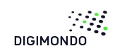

# GoLang Client for the Firefly API

| | | |
:---:|:---:|:---:
   |   | 

  

[Digimondo](https://www.digimondo.de) is a Service Provider for LoRa™ Networks based on LoRaWAN™.  
This library helps to connect Go Applications to the [FireFly API](https://apidocs.fireflyiot.com) hosted by Digimondo.

**Maintained by:** [Lobaro](http://www.lobaro.de)

# Install

    go get -u gitlab.com/lobaro/firefly-go/firefly
    
# Usage

    client := firefly.NewClient("secret-api-key")
